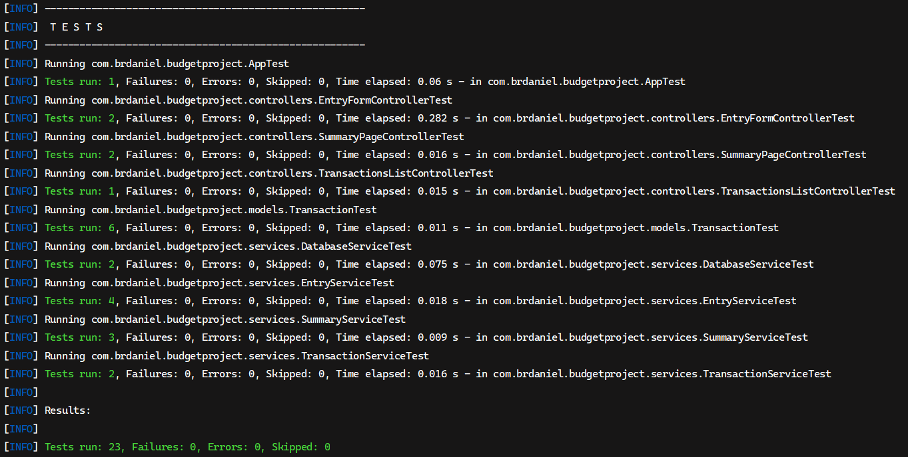

# Test Report

This report is a summary of all unit testing performed on the **budget project**.

## 🔬 Testing Environment

* **JUnit**: version 5.x
* **Java**: version 17
* **OS**: Windows 11 Home
* **Database**: SQLite

## 📰 Test Overviews

#### Controllers:
| Test # | Description                             | Pass? | Comments                               |
|--------|-----------------------------------------|-------|----------------------------------------|
| 001    | Entry form controller constructor       | ✅     | Constructor builds controller properly |
| 002    | Entry form passTransactionService       | ✅     | Transaction service passed properly    |
| 003    | Summary page controller constructor     | ✅     | Constructor builds controller properly |
| 004    | Summary page passTransactionService     | ✅     | Transaction service passed properly    |
| 005    | Transaction list controller constructor | ✅     | Constructor builds controller properly |

#### Models:
| Test # | Description              | Pass? | Comments                              |
|--------|--------------------------|-------|---------------------------------------|
| 006    | Transaction constructor  | ✅     | Constructor builds model properly     |
| 007    | Get localdate property   | ✅     | LocalDate property returns properly   |
| 008    | Get amount property      | ✅     | Amount property returns properly      |
| 009    | Get description property | ✅     | Description property returns properly |
| 010    | Get category property    | ✅     | Category property returns properly    |
| 011    | Get type property        | ✅     | Type property returns properly        |

#### Services:
| Test # | Description                                     | Pass? | Comments                                      |
|--------|-------------------------------------------------|-------|-----------------------------------------------|
| 012    | Database service read/add/delete transaction    | ✅     | Read/Add/Delete transaction works properly    |
| 013    | Database service read/update/delete transaction | ✅     | Read/Update/Delete transaction works properly |
| 014    | Entry service validate a valid date             | ✅     | Valid date is validated properly              |
| 015    | Entry service validate an invalid date          | ✅     | Invalid date is validated properly            |
| 016    | Entry service validate a valid amount           | ✅     | Valid amount is validated properly            |
| 017    | Entry service validate an invalid amount        | ✅     | Invalid amount is validated properly          |
| 018    | Summary service total income calculation        | ✅     | Total income is calculated properly           |
| 019    | Summary service total expense calculation       | ✅     | Total expense is calculated properly          |
| 020    | Summary service net balance calculation         | ✅     | Net balance is calculated properly            |
| 021    | Transaction service sort functionality          | ✅     | Sort functionality works properly             |
| 022    | Transaction service filter functionality        | ✅     | Filter functionality works properly           |

#### Build Console Log:

## 🐛 Known Bugs
* No known bugs at this time
* Refer to README.md for known issues